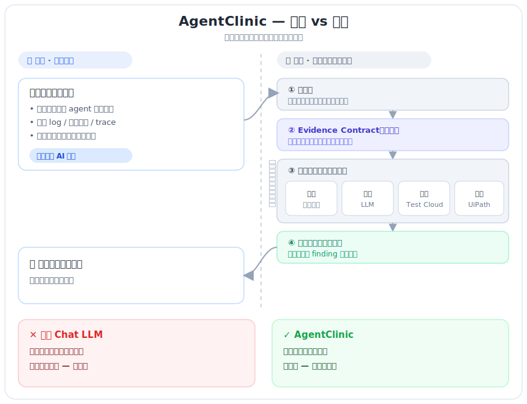

# AgentClinic — Production PRD（UiPath AgentHack Track 3）

**版本**：1.0.0（工作名 AgentClinic，可改）
**日期**：2026-06-12
**作者**：司機先生 × Chloe × Code 阿寶（Percy 平台情報 / 曦 production 架構審查）
**前身**：RaidMeter（Arize/Google 場的廠牌；本專案是 UiPath 版的獨立 artifact，全新 code）
**狀態**：草稿，待司機 + Chloe sign-off
**比賽**：UiPath AgentHack 2026 — Track 3（Agentic Testing），截止 6/29 23:45 EDT（台北 6/30 11:45）

---

## 0. 一句話定位

> **AgentClinic 是 AI agent 的「上線前體檢診所」。**
> 工程師把 agent 的執行紀錄丟進來，我們用一套固定的「病歷格式 + 檢查流程」做鑑識，出一份**每個結論都指得出證據**的診斷報告——哪幾步燒了 token、為什麼、怎麼修——全部跑在 UiPath Automation Cloud / Test Cloud 上。

不是「又一個會唬爛的 chatbot」。差別在兩件事：**不靠你會不會跟 AI 講話**，而且**每句話都釘在你資料裡的某一行**。

---

## 1. 大門 vs 後台（這版最重要的釐清）

過去討論最容易混的一點：工程師看到的，跟我們後台做的，是**兩層**。



### 1.1 大門（工程師體驗 — 沿用 RaidMeter v2 PRD 的願景，沒有改）

- 打開網頁，看到五個欄位（**全部選填**）+ 一個可選的 chat（問「我該給什麼資料」）。
- **手上有什麼丟什麼**：trace、log、commit、chat history、PR description，或只是打幾句「我覺得我的 agent 跑歪了」。
- 按「開始分析」→ 拿一份固定六段報告。
- 關 tab 就消失，要保留就下載。不需要登入、不持有資料。

**怕跟 AI 講話的人最適合——你不用跟它聊，只要把東西丟進來。**

### 1.2 後台（讓報告不是用猜的機制 — 這版新增的脊椎）

工程師丟進來的東西（亂的、少的都行）→ **adapter 正規化成內部「Evidence Contract」** → 確定性規則 + 受約束的 LLM → **每個 finding 綁證據** → 寫進 Test Cloud。

**工程師永遠看不到、不用碰 Evidence Contract。它是診所後台的病歷格式。**

### 1.3 能力隨輸入優雅降級（誠實，不裝懂）

| 工程師丟了什麼 | AgentClinic 能做到 |
|----------------|-------------------|
| 真實 trace / log（結構化執行紀錄） | 確定性鑑識，指著數據說「證據在這三行」 |
| 只有 chat history / 文字描述 | LLM 盡力推論，但**明確標出「我看不到 X，下次補 Y 更準」** |
| 幾乎沒給 | 給概念性建議 + 大面積標資訊空白 |

這就是我們贏過「直接問 ChatGPT」的地方：ChatGPT 憑你會不會問來猜；我們有制度，給多少都接，看不清的老實講。

---

## 2. 目標用戶

真實在做 AI agent 的工程師（Gerald / Vlad / Devayush 那群）。有 LLM 開發經驗、判斷力強、能評估報告品質、有付費能力。**不服務**學生 / 新手 / 消費級。

---

## 3. 五欄位輸入（大門，全選填）

| 欄位 | 形態 | 用途 |
|------|------|------|
| 問題描述 | textarea | 症狀 |
| 任務目標 | textarea | intent |
| 執行紀錄 | textarea + 上傳 | actual execution（trace/log/commit/chat）|
| 使用的 tools | textarea | 環境上下文 |
| 結果 | textarea + 上傳 | outcome |

檔案上傳限 10 MB/檔、最多 5 檔。不強制格式。欄位旁有 placeholder 提示但不限制。

---

## 4. Evidence Contract（後台脊椎，已動工）

> 曦哥定調：**守住它 = 有機會打 Track 3；守不住 = 「AI 幫我寫測試評論」的廉價作品。**

### 4.1 一條鏈

```
Trace Evidence Contract → Deterministic Score → Evidence-backed Finding → Test Cloud Execution Record
```

### 4.2 四個角色（不混）

- **判官 = Rule engine（確定性）**：不靠 LLM 也能出基本報告。
- **教練 = LLM**：只把 deterministic findings 翻成可讀 remediation。**不准重判、不准新增無證據 finding。**
- **紀錄 = Test Cloud**：execution / case log / evidence attachment。
- **編排＋治理 = UiPath**：Orchestrator + AI Trust Layer。

### 4.3 三份合約（已建草稿）

1. `contracts/trace_schema_v1.json` — 輸入合約。任何 agent 來源先正規化成這份。多一種來源 = 加一個 adapter，不動 core。
2. `contracts/finding_schema_v1.json` — 發現合約。每個 finding **必須綁至少一條 evidence span**；無證據 = 非法。confidence 在資料不足時降，不硬判。
3. `examples/golden_traces/*.golden.json` — 黃金樣本（input + expected 成對），CI 迴歸跑這些。

### 4.4 七個 waste pattern（沿用 RaidMeter 詞彙表）

`hard_hat_loop` · `state_unchanged_retry` · `lucky_guess` · `agent_piling_on` · `full_file_read_before_grep` · `redundant_tool_call` · `completion_claim_without_verification`

詞彙表給 LLM 參考，不寫死成單一偵測規則；可發現表外 pattern 但要命名 + 引證。

---

## 5. 報告六段 schema（大門輸出，沿用 v2，但現在每段綁證據）

1. **任務目標推論** — 區分「你告訴我的」vs「我推論的」+ 信心度。
2. **發現的 Pattern** — 每個 finding 綁 evidence span（來自 §4 Finding Contract）。
3. **Token 浪費估算** — 總量 / 浪費量 / 最大浪費點 + 美金（資料不足標 unknown，不編造）。
4. **修正建議** — 每條對應一個 pattern，具體可執行，附「修了省多少」。
5. **資訊空白標註** — 你沒給 X 所以我無法判斷 Y（哲學核心，不能省）。
6. **下次建議補充什麼** — 對應 §5，給優先序（這也是 v2.x roadmap 訊號）。

validator 強制六段齊全 + 每段有引證 + §5 不得為空。驗證失敗自動 retry 一次，再失敗誠實回報，不假裝完成。

---

## 6. UiPath 平台架構（Percy 平台情報落地）

### 6.1 合規硬規則（缺一不可）

- 必須用 **UiPath Studio Web** 建、跑在 **UiPath Automation Cloud**。
- 5 項等權評分含 **Platform Usage 20%**。用 coding agent 開發 +2 bonus。

### 6.2 架構（Studio Web 當主體，coded core 當引擎）

```
[Studio Web] AgentClinic Orchestrator Agent  ← 主體（解最大踩雷：不能只當 webhook）
   → 收工程師輸入 / 被測 agent 的 trace
   → 呼叫 [Coded Agent] Python core（最強鑑識 IP）
   → 寫進 [Test Cloud] Test Execution / Case Log
   全程 run on Automation Cloud；LLM 走 AI Trust Layer
```

- **Coded Agent**：Python（或 C#）SDK 在 VS Code 寫，`uipath pack` / `uipath publish` 上雲。把鑑識邏輯全放這。
- **外部 LLM（Gemini/Claude）BYOM**：AI Trust Layer → LLM Configurations → Add「OpenAI V1 compliant LLM」→ 填 OpenAI 兼容 endpoint → Connect → Agent Builder 選該 connection。**不扣 Platform Usage，反而正向 framing「用 UiPath 治理多家 LLM」。** key 用 credential asset，不寫死。
- ⚠️ **Studio Web coded agent 目前是 Preview**：別把全部風險壓在「新功能一定穩」，早做 spike。

### 6.3 Test Cloud 映射（Track 3 對題核心）

| AgentClinic 概念 | UiPath Test Cloud |
|------------------|-------------------|
| 一批被測 traces | Test Set |
| 一種 waste pattern | Test Case |
| 一次 agent run 鑑識 | Test Execution |
| 每個 finding | Test Case Log + evidence attachment |

**不能只展示 HTML report**——要讓 Test Cloud 裡真的看得到 pass/fail / execution / logs / attachments，否則被當「UiPath 外殼」。

---

## 7. Production-grade 必備（曦 production 審查七塊）

- [ ] **Schema versioning**：trace/finding schema 帶版本；多 agent 格式不同 → adapter，不寫 if/else。
- [ ] **Error / retry / idempotency 矩陣**：broken JSON→不 crash；unsupported schema→標 unsupported；missing fields→降 confidence 不硬判；LLM timeout/429→fallback 規則報告；duplicate→idempotency key 去重；partial failure→degraded mode。
- [ ] **Observability**：每 finding 綁 evidence span；接 Orchestrator logs / AI Trust Layer audit 成可查鏈路。
- [ ] **Security / PII**：trace 可能含 key / customer data → **redact 要在送 LLM 之前**；credential 走 vault/asset。
- [ ] **Cost / quota**：LLM、Test Cloud executions、storage、retry x3 都要算。
- [ ] **CI regression**：每次改版跑 golden traces 全綠才 deploy。
- [ ] **Degraded mode**：LLM 掛了，規則引擎照樣出基本報告。

---

## 8. Track 3 評審 framing

- **不要說**：「省 token 的小工具」。
- **要說**：「AI agent 的測試雲鑑識層——這類 agent workflow 每次 release 前都能被 gate」。
- Meta-testing：**用 UiPath 的 agentic testing 去測 agent 本身**。
- 對齊評審五項：business impact / platform usage depth / technical execution & production-readiness / completeness（含 error & edge case）/ creativity。demo flow：問題 → 角色 → live run → metrics（展示成功 + 失敗 + 重試 + partial）。

---

## 9. 17 天 6 階段 milestone（曦排程）

| 階段 | 日期 | 目標 / 交付 |
|------|------|------------|
| **P1** | 6/12–14 | **凍結 Evidence Contract**：trace/finding schema + deterministic scorecard + 5 條 golden traces（成功/省token/浪費/失敗/partial）。沒做完後面全是沙灘蓋房。|
| **P2** | 6/15–18 | E2E 跑通一條硬路徑：Upload → Run → Test Cloud execution → 看 evidence。**6/15 前先做 Test Cloud write spike（dummy result 也行）。** |
| **P3** | 6/19–21 | 失敗處理 + 可重跑（golden 測試全綠：schema/score 決定性/idempotency/degraded）。從 demo 變產品。|
| **P4** | 6/22–24 | LLM coaching（嚴格約束）+ 人類可讀報告。|
| **P5** | 6/25–26 | CI regression + README（用了哪些 UiPath 元件、怎麼接 LLM、怎麼跑 sample）+ setup。|
| **P6** | 6/27–28 | 錄成功 demo + 備援 demo + 凍 main branch + Deck 補 business impact + 寫 Best Product Feedback。**別 6/29 才錄。** |

留 6/29 當 buffer。

---

## 10. 範圍紀律（MoSCoW — 擋過度擴張）

**Must-have**：Studio Web Orchestrator Agent（主體）/ Python coded core / TraceSchema v1 / FindingSchema v1 / deterministic scorecard / 5–8 golden traces / Test Cloud execution + evidence 整合 / error handling + degraded mode / redaction / CI / cost estimate / 基本 dashboard。

**Could-have**：多 agent adapter / fancy UI / Action Center 人工審核 / Jira defect 整合 / 長期趨勢分析。

**Do-not-do（除非以上全做完）**：自己做整個 dashboard 平台 / 硬撐支援十種 agent（先 1–2、其餘寫 roadmap）/ 聊天式 query 報告 / 完整 SaaS 帳號系統 / 為好看重寫前端。

> production-grade = **主幹穩**，不是功能多。

---

## 11. 風險 + 時程殺手

1. 🔴 **Test Cloud 深整合**（最會拖垮）→ 6/15 前 write spike。Test Manager API 走 Swagger。
2. 🟠 **Trace schema 貪心**（想支援所有 agent）→ 先 1–2 種，其餘 roadmap。
3. 🟠 **Studio Web coded agent 是 Preview** → 早驗證、留備援。
4. 🟡 **LLM coaching 失控**（變散文 / 重判 / 編證據）→ 強制 structured output + 越界就 fallback。

---

## 12. 驗收條件

- [ ] 五欄位 + chat 引導的大門跑得起來。
- [ ] Evidence Contract（trace/finding schema）凍結，golden traces CI 全綠。
- [ ] Studio Web Orchestrator Agent 為主體，coded Python core 被呼叫，跑在 Automation Cloud。
- [ ] 外部 LLM 走 AI Trust Layer 接通。
- [ ] Test Cloud 裡看得到 Test Set / Execution / Case Log / evidence（非只 HTML report）。
- [ ] 六段報告每段綁證據，§5 資訊空白不為空。
- [ ] 錯誤矩陣 + degraded mode 實測過。
- [ ] README + setup + demo 影片。open source、MIT。

---

## 13. 三鐵律（沿用 RaidMeter DNA，實作時遇衝突停下找司機）

1. **Zero hallucination**：不知道的標 unknown，不編造。
2. **No single-signal verdict**：pattern 判斷要多重證據，不單一條件下定論。
3. **Coach not surveillance**：我們是顧問，控制權永遠在工程師手上。

---

## 14. sign-off

司機先生：________ ／ Chloe：________ ／ Code 阿寶開工：已起（P1 進行中）

**END**
